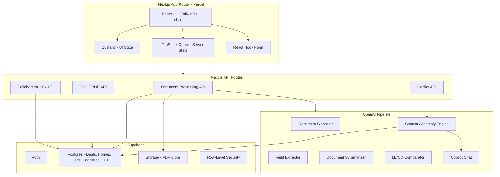
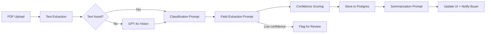

# HomeBuyer Pro v1 — Build Plan + AI Extraction Contract
## Aligned to MVP Scope Overlay v2.0 — Broad Surface, Narrow Core

---

## Architecture Overview



## Tech Stack

- **Framework:** Next.js 15 (App Router), deployed to Vercel
- **Backend:** Supabase (Postgres, Auth, Storage, RLS) + Next.js API routes for server logic
- **AI:** OpenAI GPT-4o (extraction, classification, summarization, copilot)
- **PDF Parsing:** `pdf-parse` for digital PDFs, GPT-4o Vision fallback for scanned/image docs
- **State:** TanStack Query (server state), Zustand (UI state), React Hook Form (forms)
- **Styling:** Tailwind CSS v4 + shadcn/ui, Wheat/Bronze/Mint palette from spec Section 4
- **Design Reference:** Figma MCP for component specs

## Build Depth Key

| Tier | Meaning | Build investment |
|------|---------|-----------------|
| **Deep** | Core moat. Full implementation. | High |
| **Light** | Real surface. Functional but limited. | Moderate |
| **Thin** | Visible for completeness. Minimal code. | Low |

---

## Phase 0: Foundation (Week 1)

**Goal:** Deployable shell with auth, database, design tokens, layout scaffold, and all five phases represented in the UI. After this week, the app runs and navigates — nothing functional yet, but the skeleton is complete.

### 0.1 Project Scaffolding
- `create-next-app` with App Router, TypeScript, Tailwind v4
- shadcn/ui init + configure all UI primitives from spec Section 13
- Install core deps: `@supabase/supabase-js`, `@supabase/ssr`, `@tanstack/react-query`, `zustand`, `react-hook-form`, `motion/react`, `lucide-react`, `recharts`
- Set up project structure per spec Section 5.2 (including `shopping/`, `offer/`, `post-close/` directories)

### 0.2 Design System Tokens
- Configure Tailwind with full Wheat/Bronze/Mint palette from spec Section 4.1:
  - Background `#F5DEB3`, Card `#FFFFFF`, Secondary `#FEFCF8`
  - Foreground `#2D3748`, Muted `#767676`
  - Accent `#D38E45`, Primary `#6EE7B7`, Success `#10B981`
  - Warning `#F59E0B`, Destructive `#E53E3E`, Border `#E8DBBF`
  - Chart colors: `#D38E45`, `#6EE7B7`, `#E8B84E`, `#767676`, `#E53E3E`
- Typography scale per spec Section 4.2
- Border radius, shadow, spacing tokens per Section 4.3
- Global CSS variables for cross-component consistency

### 0.3 Supabase Setup
- Create Supabase project
- Database schema (see below)
- Row-level security policies (deal isolation by user)
- Auth configuration (email/password for beta)
- Storage bucket for document PDFs (private, scoped to deal)

### 0.4 Auth Flow
- Supabase Auth integration with Next.js middleware
- Sign up / sign in pages
- Protected route middleware
- Auth context provider

### 0.5 Layout Shell
- App layout: sidebar (256px) + main content + floating AICopilot button
- Progress stepper (`ProgressStepper`) — 69px, fixed top, 5-phase, Mint for completed/current, Gray for future
- **Sidebar navigation: 3 items** (confirmed from Figma) — Dashboard, Documents, Financing
  - "HomeBuyer Pro" wordmark above nav
  - Phase-contextual CTA button at sidebar bottom
- Global footer (`GlobalFooter`) — 52px, fixed bottom, disclaimer text
- **AICopilot**: Two states. Collapsed = 56x56 Bronze floating button, fixed bottom-right. Expanded = right-side panel (~300px), chat UI with message history, input field, send button (Mint), quick-action chips ("Explain this document", "Calculate closing costs", "Market analysis"). Default collapsed.
- Phase-aware dashboard renders Shopping/Offer/Escrow/Closing/Post-Close based on `currentPhase`
- State architecture: Zustand store for UI state, TanStack Query provider

### Phase 0 Database Schema

```sql
-- User-facing tables
saved_homes (id, user_id, address, price, beds, baths, sqft, notes,
             image_url, status, created_at)

deals (id, user_id, saved_home_id, property_address, purchase_price,
       offer_price, earnest_money, contract_acceptance_date, closing_date,
       agent_name, agent_contact, current_phase, created_at, updated_at)

offer_details (id, deal_id, offer_price, earnest_money, closing_date,
              contingency_inspection_days, contingency_appraisal_days,
              contingency_financing_days, contingency_disclosure_days,
              pre_approval_doc_id, proof_of_funds_doc_id,
              checklist_items, status, created_at)

documents (id, deal_id, name, file_path, file_size, mime_type, doc_type,
           category, stage, status, version, extracted_text,
           extracted_fields, ai_summary, source_type, confidence_score,
           created_at, updated_at)

deadlines (id, deal_id, name, type, due_date, status, notes,
           linked_document_ids, created_at)

loan_estimates (id, deal_id, lender, product, loan_amount, down_payment,
               rate, apr, points, lender_fees, third_party_fees, pmi_monthly,
               impounds, cash_to_close, lock_status, lock_expires,
               prepay_penalty, is_chosen, pdf_document_id, created_at)

closing_disclosures (id, deal_id, loan_estimate_id, extracted_fields,
                     variance_summary, pdf_document_id, created_at)

collaborator_links (id, deal_id, recipient_role, recipient_email,
                    link_token, requested_documents, expires_at,
                    status, uploads_received, created_at)

copilot_messages (id, deal_id, role, content, citations, phase,
                  created_at)

-- Indexes: deal_id on all tables, user_id on deals + saved_homes, due_date on deadlines
-- RLS: All queries scoped to deals.user_id = auth.uid() or saved_homes.user_id = auth.uid()
```

---

## Phase 1: Light Surfaces + Deal Pipeline (Weeks 2-3)

**Goal:** Shopping and Offer are functional light surfaces. A buyer can track homes, set up an offer, transition into Escrow, and start uploading documents. The product feels like a complete workspace from day one — not a tool that only activates at escrow.

### 1.1 Shopping Dashboard — Build Light (Week 2)
*Component name confirmed from Figma: `ShoppingView`*

**4 CollapsibleCards (confirmed from Figma deep inspection):**
1. **Your Buy Box** — Target criteria: price range, bedrooms, target area. Manual input only.
2. **Saved Homes** — Per-home rows: address, city, price, beds/baths/sqft, days on market, "Active" status badge, "Move to Offer" button. Manual entry only.
3. **Affordability Estimate** — Purchase price input, down payment %, estimated cash-to-close output. Manual inputs only — no address enrichment, no property lookup, no automated data.
4. **Market Snapshot** — Median home price, avg days on market, market trend ("Competitive"). Buyer-entered or manually maintained reference context — not live data, not API-fed. This card is informational context only.

**Explicit boundary:** All property data is buyer-entered. No MLS lookup, no address enrichment, no Zillow/Redfin import, no automated listing metadata. If it's not typed by the buyer, it doesn't exist in v1.

- "Add Property" button (Accent/Bronze)
- Home tracking lives inside the Shopping dashboard, NOT a separate sidebar nav item

### 1.2 Offer Workspace — Build Light (Week 2)
*Component name confirmed from Figma: `OfferView`*

**Header:** "Offer Workspace" / "Structure and prepare your offer" / "Offer in Progress" status badge (Bronze)
**Property card:** Address, city, beds/baths/sqft, list price

**4 CollapsibleCards (confirmed from Figma deep inspection):**
1. **Offer Details** — Offer price, earnest money deposit, down payment %, closing timeline. Editable input fields.
2. **Contingencies** — Checkboxes + day inputs: Inspection (10d), Loan (21d), Appraisal (17d), Sale of Current Home. Feeds directly into Escrow deadline computation.
3. **Supporting Documents** — Pre-approval letter upload, proof of funds upload. Shows file name, size, upload date.
4. **Offer Readiness** — Checklist: pre-approval attached, proof of funds uploaded, EMD set, contingencies defined, offer expiration set. Progress tracking.

- "Review & Submit Offer" button (Accent/Bronze)
- **"Offer Accepted — Start Escrow" CTA** (Accent/Bronze) → creates deal workspace, computes deadlines
- "Upload Additional Document" action

**Legal boundary:** The offer workspace captures buyer-entered terms and uploaded documents. It does not generate, validate, or negotiate legal contract language.

### 1.3 Deal Workspace Creation (Week 2-3)
- **From Offer flow:** CTA creates deal, populates from offer_details, sets phase to Escrow
- **Direct entry (mid-journey):** Deal setup form for buyers already under contract
- Deal summary card on dashboard (address, price, dates, countdown)
- Five-phase map set to Escrow active
- Auto-compute deadlines from contingency setup

### 1.4 Document Upload (Week 3)
- Upload UI: drag-and-drop + file select (spec Section 10.1)
- Upload to Supabase Storage (private bucket, `{deal_id}/{doc_id}/{filename}`)
- Document row component with status indicator
- Upload progress + toast notifications

### 1.5 PDF Text Extraction (Week 3)
- Next.js API route: `/api/documents/process`
- Digital PDF extraction via `pdf-parse` (primary path)
- Scanned/image detection: if text is empty or below threshold, route to GPT-4o Vision
- Store raw text in `documents.extracted_text`
- Error handling: flag failures for manual review

### 1.6 Document Classification (Week 3)
- OpenAI classification prompt: identify document type from extracted text
- Taxonomy: purchase_contract, loan_estimate, closing_disclosure, inspection_report, appraisal, title_report, disclosure, insurance_binder, pre_approval, proof_of_funds, other
- Auto-assign category and stage
- Auto-place in correct Smart Tab

---

## Phase 2: AI Extraction + Copilot Core (Weeks 3-5)

**Goal:** The AI can extract structured fields from documents, summarize them in plain English, and answer deal-specific questions. The copilot is phase-aware — lighter in Shopping/Offer, deep in Escrow/Closing.

### 2.1 Field Extraction Pipeline — Tier 1 Focus (Week 3-4)
- **Tier 1 first:** Purchase contract, Loan Estimate, Closing Disclosure, Inspection report
- Per-document-type extraction prompts (see AI Extraction Contract below)
- Structured JSON output via OpenAI function calling
- Confidence scoring per field (high / medium / low)
- Store in `documents.extracted_fields` (JSONB)
- Low-confidence flag for human review
- **Tier 2 (appraisal, title, disclosures, insurance binder):** classification + summarization ships now; full field extraction deferred to Phase 4 or polish

### 2.2 Document Summarization (Week 4)
- Summarization prompt per document type
- AI Summary panel in slide-over viewer
- "Explain this document" button
- "What should I look for?" contextual prompt
- Store in `documents.ai_summary`

### 2.3 Documents View — Build Deep (Week 4)
- Smart Tabs: Essentials, Disclosures, Financing, Inspections, Escrow/Title, Closing
- Document row list with status badges, source indicator, timestamps
- Stage Essentials card (X of Y complete, urgent chips)
- Slide-over PDF viewer with metadata sidebar + AI summary panel
- "Draft a question about this" action
- Bulk selection bar (download ZIP, mark reviewed)

### 2.4 Copilot Chat Interface (Week 4-5)
- Collapsed: 56x56 Bronze floating button, bottom-right, fixed
- Expanded: right-side panel (~300px), "AI Copilot" header with expand/close buttons
- Chat UI: message input ("Ask about homebuying, documents, or scenarios..."), message history with timestamps, rich content rendering (tables, lists, callouts)
- Send button (Mint Green)
- **Quick-action chips** pinned at bottom of panel: "Explain this document", "Calculate closing costs", "Market analysis" — phase-aware (chips change based on current phase)
- Message persistence per deal in `copilot_messages`

### 2.5 Context Assembly Engine (Week 5)
- Server-side context builder: deal state + document extractions + deadlines + open issues
- **Phase-aware depth:**
  - Shopping/Offer: lighter context, general education system prompt
  - Escrow/Closing: full deal-context, grounding enforcement, citation requirements
- Context window management: prioritize most relevant docs, recent changes, active deadlines
- Boundary behavior: system prompt enforces prohibited behaviors per spec Section 8.4
- Response format: structured output with citations, next steps, boundary statements

### 2.6 Question Drafting (Week 5)
- "Draft a question about this" in document viewer
- Smart questions for agent, lender, escrow officer
- Contextual to specific document and deal state

---

## Phase 3: Financing Clarity — Build Deep (Weeks 5-6)

**Goal:** LE comparison, LE vs CD variance review, and cash-to-close engine. Highest-value v1 feature cluster.

### 3.1 Loan Estimate Entry + Cards (Week 5)
- LE form modal (all fields from spec Section 10.2)
- LE card component (rate, APR, monthly P&I, lock status, chosen indicator)
- Grid layout (3 columns desktop)
- "Set as Chosen" / "Select for Compare" actions
- PDF attachment link

### 3.2 Auto-Populate from Extraction (Week 5)
- When document classified as `loan_estimate`, auto-create `loan_estimates` row from extracted fields
- Buyer reviews and corrects auto-populated values
- Link `loan_estimates.pdf_document_id` ↔ `documents.id`

### 3.3 LE Comparison Table (Week 6)
- Triggered when 2-3 estimates selected
- Optimization toggle (minimize monthly payment / cash to close / total cost)
- Best-value highlighting with Primary/Mint checkmarks
- Side-by-side: monthly P&I, upfront costs, cash to close, APR, PMI, lock status

### 3.4 LE vs CD Variance Panel (Week 6)
- Triggered when both LE and CD uploaded and extracted
- Side-by-side with tolerance highlighting (>$100 or >10%)
- AI-powered variance narrative
- TILA tolerance rules reference

### 3.5 Cash-to-Close Engine (Week 6)
- Live calculation from chosen LE + CD data
- Breakdown: down payment, closing costs, prepaids, credits, prorations
- Updates as new documents arrive
- Historical change tracking
- Sticky snapshot footer when chosen loan exists

---

## Phase 4: Escrow Dashboard — Build Deep (Weeks 6-7)

**Goal:** The primary v1 experience. Full component set from spec Section 9.4.

### 4.1 Contingency Countdown (Week 6)
- Visual timeline with days remaining per contingency
- Color-coded urgency (Primary/green > Warning/orange > Destructive/red)
- Auto-computed from deal setup / offer contingency dates
- Removal/waiver tracking

### 4.2 Earnest Money Tracker (Week 6)
- Deposit amount, deadline countdown, confirmation status
- Wire/check instructions display
- Escrow company details

### 4.3 Due Diligence Components (Week 7)
- Appraisal Status: order tracking, gap analysis, next steps
- Inspection Checklist: types (General, Pest, Roof, HVAC, Foundation), schedule, report upload
- AI Red-Flag Summary: auto-generated when inspection report uploaded and extracted

### 4.4 Repairs, Issues, Alerts (Week 7)
- Repairs/Credits Tracker: item list, costs, negotiation status, dollar impact
- Escrow/Title Alerts: liens, easements, delays, missing signatures, wire fraud warnings
- Loan Financing: progress tracker, underwriting status, conditions, lock expiration
- Disclosures & Documents: required list, review tracking, 3-day period

### 4.5 Escrow Cash-to-Close (Week 7)
- Escrow-specific version pulling from latest data
- Actual vs estimated, credits applied, prorations, final amount due

---

## Phase 5: Closing + Collaboration + Post-Close (Weeks 7-8)

**Goal:** Closing phase deep build, collaborator upload link, and Post-Close thin continuity. After this phase, the full shopping-to-close flow is functional end to end.

### 5.1 Closing Dashboard — Build Deep (Week 7-8)
*Figma name: "Main Content" inside App — uses `CollapsibleCard` sections + `ClosingAlerts`*

**Header:**
- "Final steps to complete your purchase"
- Property address, closing date, purchase price
- "Recording Complete — Keys in Hand!" CTA (top of view)

**Critical Final Steps** — 3 CollapsibleCards (each 368x726), each containing a named component:
- `ClosingDisclosureReview` — CD vs LE comparison, "Open CD" + "Explain Differences" buttons
- `CashToCloseFinalizer` — Line-item breakdown, "Confirm Amount" CTA
- `SigningAppointment` — Scheduling, required items checklist, "Confirm Appointment" / "Reschedule"

**Pre-Closing Verification** — 3 CollapsibleCards (each 368x830):
- `FinalWalkthroughChecklist` — Room-by-room checklist (71% complete in prototype), "Upload Photos" / "Complete Walkthrough"
- `InsuranceBinderVerification` — Policy active/bound status, binder verification, premium included in closing costs
- `UnderwritingConditionsFinal` — Outstanding conditions, "Submit Remaining Docs" CTA

**Funding & Transfer** — 3 CollapsibleCards (each 368x818):
- `WireTransferSafeSend` — CRITICAL fraud prevention. Verification steps, phone confirmation, "Upload Receipt" / "Mark as Wired"
- `TitleEscrowFinalChecks` — Last-minute red flags, "View Full Report" / "Acknowledge & Continue"
- `FundingRecordingTimeline` — Step tracker (fund → disburse → record → keys), "I've Picked Up the Keys" CTA

**Alerts & Issues** — CollapsibleCard (1152x352) containing:
- `ClosingAlerts` (1102x234) — Individual alert rows with action buttons ("Contact Lender", "Review Changes", "Monitor Status")

**Internal build priority for Phase 5 (if time gets tight):**
1. Closing Disclosure review + LE vs CD variance
2. Wire fraud SafeSend
3. Underwriting / final checks
4. Collaborator upload link
5. Post-close continuity

### 5.2 Secure Collaborator Upload Link — Build Light (Week 8)
- Generate unique link per collaborator (agent, lender, escrow, title)
- No-account upload page: open link, upload files
- Files flow into buyer's deal workspace via same AI classification + extraction pipeline
- Link expiration, revocation, upload count tracking
- Buyer notification of new uploads
- **Tagging rule:** If the link specifies requested document types, uploaded files inherit those tags by default and still pass through AI classification. Classification can override if the actual document differs from the request.

### 5.3 Post-Close — Thin Continuity (Week 8)
*Component name confirmed from Figma: `PostCloseView`*

**Header:**
- "Congratulations! 🎉"
- "You've successfully closed on [address]. Your journey is complete!"
- Closing Date + Final Purchase Price display

**CollapsibleCard 1: Deal Summary** — Purchase price, down payment, loan amount, interest rate, total cash to close, monthly PITI

**CollapsibleCard 2: Document Archive** — Individual document rows, each with name, file size, date, "Download" button:
- Closing Disclosure, Final Title Policy, Deed of Trust, Settlement Statement, Home Inspection Report, Appraisal Report
- "Download Complete Archive (ZIP)" link (Accent/Bronze text)

**Coming Soon cards:**
- Equity Tracking — "Monitor your home's value and equity growth over time" + "Coming Soon"
- Homeowner Tools — "Maintenance tracking, warranty management, and more" + "Coming Soon"

**Closing message:** "Thank you for using HomeBuyer Pro" + "We hope we helped make your homebuying journey clearer and less stressful."

### 5.4 Phase Transitions (Week 8)
- Shopping → Offer: "Ready to make an offer?" with home pre-population
- Offer → Escrow: "Offer Accepted" with deal workspace creation
- Escrow → Closing: "All Contingencies Clear? Proceed to Closing"
- Closing → Post-Close: "Recording Complete — Keys in Hand!"

---

## Phase 6: Polish + Beta Launch (Weeks 9-12)

**Goal:** Production-ready beta. Sequenced ruthlessly — core stability first, polish second, mobile last.

**Week-by-week sequencing (strict order, not parallel):**
- **Week 9:** Tier 2 extraction + onboarding paths
- **Week 10:** Security + validation + desktop polish
- **Week 11:** Mobile/responsive only if core is stable; otherwise bug fixing
- **Week 12:** Beta onboarding + real-user seeding + bug fixing

### 6.1 Tier 2 Extraction + Onboarding (Week 9-10)
- Tier 2 field extraction for appraisal, title report, disclosures, insurance binder
- Landing page (simple, warm, trust-communicating)
- **Path A (Shopper):** "I'm shopping for a home" → Shopping dashboard
- **Path B (Under contract):** "I have an accepted offer" → Deal setup → Escrow
- Both paths get copilot introduction and guided first steps

### 6.2 Emotional Identity Polish (Week 10)
- Phase stepper animations and transitions
- Contextual glossary / term explanations (inline, hover/tap)
- Alerts panel styling and urgency states
- Toast notifications across all actions
- Empty states for all views (Shopping with no homes, Escrow with no documents, etc.)
- Loading skeletons

### 6.3 Responsive / Mobile (Week 10-11)
- Sidebar collapse to hamburger
- Single-column layouts
- Full-screen modals on mobile
- Touch targets (44px min)
- Copilot panel behavior on small screens
- Progress stepper vertical on mobile

### 6.4 Performance + Security (Week 11)
- Route-based code splitting
- Image/component lazy loading
- Supabase RLS audit
- Input validation (client + server)
- Rate limiting on AI API routes
- Document upload size limits
- CORS and CSP headers

### 6.5 Beta Deployment (Week 11-12)
- Vercel production deploy
- Supabase production project
- OpenAI API key management (env vars, usage monitoring)
- Error tracking (Sentry)
- Basic analytics (Vercel Analytics or PostHog)
- Seed beta with 2-3 real buyers (mix of shoppers and buyers under contract)

---

## AI / Data Extraction Contract

### Pipeline Architecture



### Document Type Tiers

Not all document types are equally important for beta. Extraction effort should be concentrated on Tier 1 first.

| Tier | Document types | Rationale |
|------|---------------|-----------|
| **Tier 1 — Must extract** | Purchase contract, Loan Estimate, Closing Disclosure, Inspection report | These drive the highest-value workflows: deadline computation, LE comparison, LE vs CD variance, cash-to-close, red-flag summaries. Beta is not viable without them. |
| **Tier 2 — Should extract** | Appraisal, Title report, Disclosures, Insurance binder | Important for completeness but lower extraction urgency. Classification + summarization may ship before full field extraction. |

**Build plan implication:** Phase 2 field extraction (Weeks 3-4) focuses on Tier 1. Tier 2 gets classification + summarization in Phase 2, with full field extraction added in Phase 4 or during polish.

### Document Types + Extraction Fields

**1. Purchase Contract / RPA** — Tier 1

| Field | Type | Required | Notes |
|-------|------|----------|-------|
| property_address | string | Yes | Full street address |
| purchase_price | number | Yes | Dollars |
| buyer_names | string[] | Yes | All buyers |
| seller_names | string[] | Yes | All sellers |
| contract_date | date | Yes | Acceptance date |
| closing_date | date | Yes | Expected COE |
| earnest_money | number | Yes | EMD amount |
| inspection_period_days | number | Yes | From acceptance |
| appraisal_contingency_days | number | Yes | From acceptance |
| financing_contingency_days | number | Yes | From acceptance |
| disclosure_review_days | number | No | Typically 3-5 |
| special_terms | string | No | Free-text addenda summary |
| listing_agent | string | No | |
| buyers_agent | string | No | |
| escrow_company | string | No | |
| title_company | string | No | |

**2. Loan Estimate (LE)** — Tier 1

| Field | Type | Required | Notes |
|-------|------|----------|-------|
| lender_name | string | Yes | |
| loan_product | string | Yes | e.g., "30-year fixed" |
| loan_amount | number | Yes | |
| interest_rate | number | Yes | Percentage |
| apr | number | Yes | Percentage |
| monthly_pi | number | Yes | Principal + interest |
| estimated_total_closing | number | Yes | Section J total |
| cash_to_close | number | Yes | |
| points | number | No | Negative = credits |
| lender_fees | number | Yes | Origination + underwriting |
| third_party_fees | number | Yes | Appraisal, title, etc. |
| pmi_monthly | number | No | $0 if >20% down |
| impounds | boolean | Yes | |
| prepay_penalty | boolean | Yes | |
| lock_status | string | No | "locked" or "floating" |
| lock_expiration | date | No | |
| down_payment_pct | number | Yes | |

**3. Closing Disclosure (CD)** — Tier 1

Same fields as LE, plus:

| Field | Type | Required | Notes |
|-------|------|----------|-------|
| final_cash_to_close | number | Yes | |
| prorations | number | No | Tax/HOA prorations |
| seller_credits | number | No | |
| recording_fees | number | No | |
| transfer_taxes | number | No | |
| prepaid_items | number | No | |
| initial_escrow | number | No | |

**4. Inspection Report** — Tier 1

| Field | Type | Required | Notes |
|-------|------|----------|-------|
| inspector_name | string | No | |
| inspection_date | date | Yes | |
| inspection_type | string | Yes | general, pest, roof, hvac, foundation |
| major_findings | object[] | Yes | { description, severity, location, estimated_cost } |
| minor_findings | object[] | No | Same structure |
| systems_condition | object | No | { hvac, electrical, plumbing, roof, foundation } rated |
| recommended_actions | string[] | No | |
| overall_condition | string | No | good / fair / poor |

**5. Appraisal** — Tier 2

| Field | Type | Required | Notes |
|-------|------|----------|-------|
| appraised_value | number | Yes | |
| appraisal_date | date | Yes | |
| property_sqft | number | No | |
| comparable_sales | object[] | No | { address, sale_price, date } |
| appraisal_gap | number | Computed | purchase_price - appraised_value |
| condition_notes | string | No | |

**6. Title Report / Preliminary Title** — Tier 2

| Field | Type | Required | Notes |
|-------|------|----------|-------|
| property_legal_description | string | No | |
| current_owner | string | No | |
| liens | object[] | Yes | { type, holder, amount, status } |
| easements | object[] | No | { type, description } |
| encumbrances | string[] | No | |
| exceptions | string[] | No | Standard and special |
| title_insurance_premium | number | No | |

**7. Disclosures (TDS, NHD, etc.)** — Tier 2

| Field | Type | Required | Notes |
|-------|------|----------|-------|
| disclosure_type | string | Yes | TDS, NHD, lead_paint, etc. |
| key_disclosures | string[] | Yes | Material facts |
| known_defects | string[] | No | |
| required_acknowledgment | boolean | Yes | Buyer signature needed? |
| review_deadline | date | No | |

**8. Insurance Binder** — Tier 2

| Field | Type | Required | Notes |
|-------|------|----------|-------|
| carrier | string | Yes | |
| policy_type | string | No | HO-3, HO-5 |
| annual_premium | number | Yes | |
| coverage_dwelling | number | No | Coverage A |
| deductible | number | No | |
| effective_date | date | Yes | |
| mortgagee_clause | string | No | |

### Confidence Scoring

Each extracted field receives a confidence level:

- **High (>90%):** Field clearly present, unambiguous, consistent with document type. Stored as-is. No user flag.
- **Medium (60-90%):** Likely correct but ambiguous or partially obscured. Stored with `needs_review: true`. Shown with subtle "verify this" indicator.
- **Low (<60%):** Uncertain extraction. Stored with `low_confidence: true`. Shown with explicit "please verify" prompt.

Confidence is determined by: field found in expected location, value passes type/range validation, GPT-4o expressed uncertainty, source was digital text (higher) vs OCR/Vision (lower).

### Storage Model

- **Structured data** (`extracted_fields` JSONB) — Typed fields. Queryable. Feeds LE comparison, cash-to-close, deadline computation.
- **AI summary** (`ai_summary` text) — Plain-English summary. Displayed in viewer. Not used for computation.
- **Raw text** (`extracted_text` text) — Full extracted text. Used for copilot grounding and citations.
- **Page references** — Extraction prompt requests page numbers. Stored as `_page_ref` per field for citation.

### Citation Format in Copilot Responses

```
"Your cash to close increased by $1,240 from your original Loan Estimate.
The main change is in third-party fees — specifically the title insurance
premium went from $1,800 to $2,340. [Closing Disclosure, p.2, Section H]
This is within TILA tolerance limits but worth confirming with your lender."
```

Pattern: `[Document Name, page, section]` inline in natural language.

### Engineering Rule: Deterministic Computation Over Model Inference

**When structured fields are available, deterministic code always wins over LLM inference.**

This means:
- Deadline dates → computed from contract dates + contingency days. Not inferred by the model.
- Cash-to-close math → calculated from extracted LE/CD fields. Not estimated by the model.
- LE vs CD variance numbers → computed by comparison logic. The model explains the result, it does not produce it.
- Monthly P&I → standard amortization formula. Not generated text.
- Progress/completion status → derived from data state (checklist counts, document statuses). Not judged by the model.

The AI copilot's job is to **explain, contextualize, and surface implications** — not to perform math or decide status. If a number can be computed, compute it. If a status can be derived, derive it. The model adds understanding, not arithmetic.

### Phase-Aware AI Context Assembly

| Phase | Context assembled | System prompt mode |
|-------|-------------------|-------------------|
| Shopping | Saved homes, pre-approval status, affordability inputs | General education. Answer readiness questions. No deal-specific grounding. |
| Offer | Offer details, contingency setup, checklist status | Offer education. Explain contingencies, EMD, timelines. Lighter grounding. |
| Escrow | Full deal: documents + extracted fields + deadlines + open issues + chosen LE + missing items | Full deal-context. Citations required. Grounding enforced. Action-oriented. |
| Closing | Same as Escrow + CD data + variance analysis + wire instructions | Full deal-context. Same depth. CD comparison, wire safety, signing prep. |
| Post-Close | Deal summary, completed milestones | Light completion. Summarize deal. Suggest next steps for new homeowners. |

---

## Milestone Checkpoints

| Week | Milestone | Ship gate |
|------|-----------|-----------|
| 1 | Foundation deployed, auth works, layout renders with all 5 phases | Can sign up and navigate Shopping/Offer/Escrow/Closing/Post-Close shells |
| 3 | Shopping + Offer light surfaces work; documents upload + classify | Can track homes, set up offer, transition to Escrow, upload and classify a PDF |
| 5 | AI copilot answers questions; Tier 1 field extraction running | Can ask the AI about a document and get a grounded answer with citations |
| 7 | LE comparison + cash-to-close + Escrow dashboard functional | Can compare loan estimates, see cash-to-close, track deadlines with real data |
| 9 | Closing + collaborator link + Post-Close complete | Full shopping-to-close flow functional end to end |
| 10 | Security + validation + desktop polish | Auth/RLS audited; input validation solid; desktop UI polished and stable |
| 11 | Mobile/responsive (only if core is stable) | Product works on mobile; or this week is bug fixing if core needs it |
| 12 | Beta deployed with real users | 2-3 buyers using the product with real documents |

**Week 8 checkpoint:** If Week 8 arrives and Closing is not functional, invoke the cut list (see below). Do not let polish eat into core feature time.

---

## Risk Register

| Risk | Mitigation |
|------|------------|
| PDF extraction quality varies | Digital-first with Vision fallback; confidence scoring; human review flags |
| OpenAI rate limits / latency | Queue extraction jobs; cache summaries; show "processing" state |
| Solo dev timeline slips | 10-12 week range gives 2 weeks of buffer. Cut list defines what drops first. Ship ugly before shipping late. |
| Light phases feel like dead ends | Ensure Shopping → Offer → Escrow transitions feel seamless. Empty states guide the user forward. |
| Scope creep from "just one more Shopping feature" | MVP overlay v2.0 is the scope authority. If it's not in Build Deep or Build Light, it doesn't get built. |
| Supabase RLS complexity for collaborator links | Collaborator links use separate auth-free API route with link token validation |
| Phase-aware AI feels inconsistent | Clear system prompt switching. User-facing messaging: "I'll know more once you upload documents in escrow." |
| Tier 1 extraction takes longer than expected | Focus on purchase contract + LE first (they feed the most workflows). CD and inspection can follow a week later. |

---

## Beta-Ready Definition

The product is beta-ready when all of the following are true. This is the minimum bar — do not ship below it, and do not gold-plate above it.

**Must be true for beta:**
1. A buyer can sign up, track a home, set up an offer, and transition into Escrow
2. A buyer under contract can skip Shopping/Offer and enter directly at Escrow via deal setup form
3. Documents can be uploaded and are classified + summarized by AI
4. Tier 1 document types (purchase contract, LE, CD, inspection) have field extraction working
5. When a Loan Estimate is uploaded and extracted, the system auto-populates a `loan_estimates` row **with buyer review/edit confirmation before saving** (not silent creation)
6. LE comparison works with 2-3 estimates side by side
7. LE vs CD variance panel renders when both docs are uploaded
8. Cash-to-close engine produces a live number from chosen LE (deterministic computation, not LLM inference)
9. Contingency countdown renders deadlines from deal setup / offer contingency days
10. Closing Disclosure review + wire fraud SafeSend flow are functional
11. AI copilot answers deal-specific questions with citations in Escrow/Closing
12. Collaborator upload link works (no-account file intake)
13. Post-Close shows completion screen + document archive with individual download buttons
14. Auth, RLS, and basic input validation are in place
15. The product works on desktop (mobile is a plus, not a gate)

**Not required for beta:**
- Tier 2 field extraction (classification + summary is sufficient)
- Full responsive/mobile polish
- Email/SMS notifications
- Insurance view depth
- Performance optimization beyond basic code splitting
- Full accessibility audit

---

## Cut List (If Timeline Slips)

Ordered by what drops first. Each cut removes scope without breaking the core product.

| Priority | What to cut | Impact | When to decide |
|----------|------------|--------|----------------|
| Cut 1 | Tier 2 field extraction (appraisal, title, disclosure, binder) | Classification + summarization still work. Copilot can answer questions from raw text. Structured comparison loses some depth. | Week 8 |
| Cut 2 | Responsive/mobile polish | Desktop-only beta. Most escrow work happens at a desk anyway. | Week 9 |
| Cut 3 | Post-Close thin continuity | Replace with a simple "Congratulations" page and download-all-docs button. First-30-days checklist and email capture dropped. | Week 8 |
| Cut 4 | Shopping affordability snapshot | Keep saved homes + pre-approval card. Drop the estimator. Buyers can still track homes and transition to Offer. | Week 6 |
| Cut 5 | Offer checklist completion tracking | Keep the offer details form + contingency setup (these feed Escrow). Drop the visual checklist with checkbox progress. | Week 6 |
| Cut 6 | Copilot in Shopping/Offer phases | Keep copilot in Escrow/Closing only. Shopping/Offer get static educational content instead of live AI. | Week 7 |

**Rule:** Never cut from Build Deep. Cuts come from Build Light and Thin Continuity only. The moat is non-negotiable.
